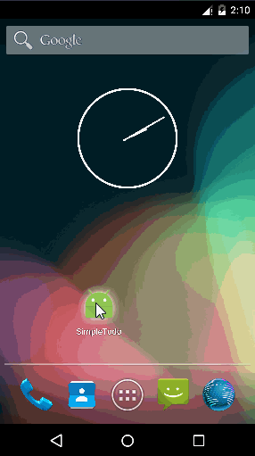
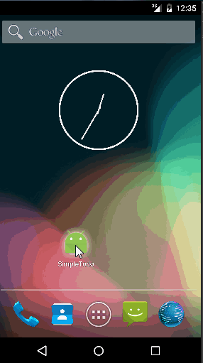

# Android_SimpleTodo - A Todo List Application

Features :
* Users can add an item to the todo list.
* Users can remove an item from the todo list (by long pressing on the item).
* Users can tap an item to edit it -> done via intents and edit item activity.
* The items are persisted and retrieved on app restart.

Enhancements:
* Ask for user confirmation before deletion on long click (using AlertDialog & DialogInterface).
* Don't allow for blanks (empty item) to be added as new item.
* Don't allow editing an existing item and reset it to a blank.
* Trim leading and trailing spaces in the entered item, if any.

Demo:

No Duplicates Allowed:

