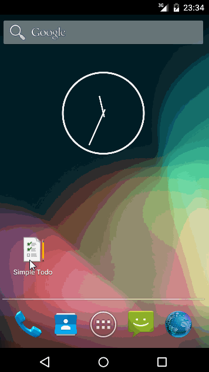

# Android_SimpleTodo - A Todo List Application

Developed as a part of CodePath Bootcamp Pre-work.

====== Features ======
* Users can add an item to the todo list.
* Users can remove an item from the todo list (by long pressing on the item).
* Users can tap an item to edit it -> done via intents and edit item activity.
* The items are persisted and retrieved on app restart.

====== Enhancements ======
* Custom Adapter for list view to display item name, completion due date and priority.
* Set Completion due date and display it in list view for each item. Users can also choose to skip due date, in which case "No Due Date" will be displayed.
* Set priority for each item - Low/Medium/High. If no priority is chosen by user, default priority is Medium.
* Color code each item by priority - Green/Blue/Red
* Action bar enabled to perform sorting of items.
* Sorting of item done based on priority (ascending i.e. Low to High OR descending i.e. High to Low).
* Add new items in sorted fashion when list view is sorted (both ascending and descending supported).
* Clear list view sorting and retrieve original order of item addition.
* New app icon.
* Use SQLite instead of file.
* No duplicates allowed, notified to user via Toast message.
* Ask for user confirmation before deletion on long click (using AlertDialog & DialogInterface).
* Don't allow for blanks (empty item) to be added as new item.
* Don't allow editing an existing item and reset it to a blank.
* Trim leading and trailing spaces in the entered item, if any.

====== Demo: Add Items ======

====== Demo: Edit/Delete items ======

====== Demo: No Duplicates ======

====== Demo: Sort items by Priority ======

====== Demo: Add items in already sorted order ======

